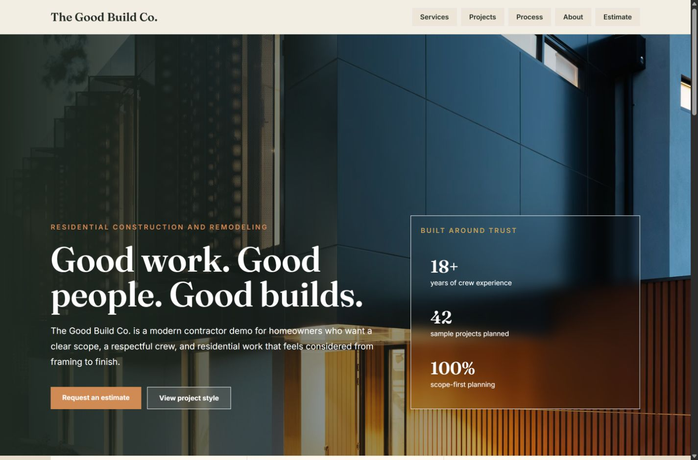
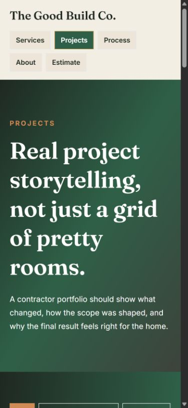
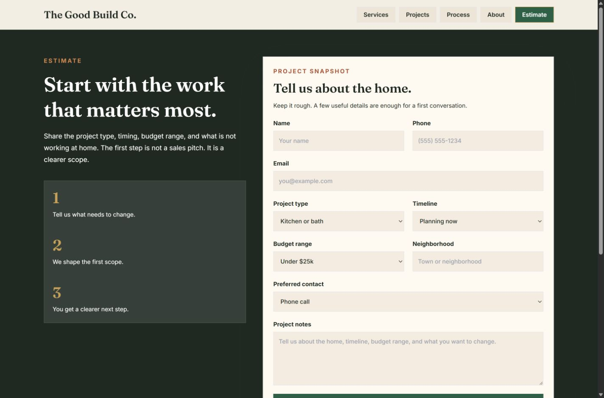

# The Good Build Co.

Premium React and Tailwind demo website for a modern residential construction company.

## Current Stage

Stage 8: portfolio packaging.

## Brand Direction

Name:

```text
The Good Build Co.
```

Slogan:

```text
Good work. Good people. Good builds.
```

Positioning:

- Local, trustworthy, and professional.
- Warm enough for homeowners.
- Premium enough for remodels, additions, kitchens, baths, decks, and whole-home projects.
- Frontend-only demo first, with backend features deferred until they are useful.
- Multi-page structure for services, projects, process, about, and estimate flow.
- Project gallery with categories, case-study notes, scope details, and finish notes.
- Frontend-only estimate flow with validation, preferred contact method, and request summary.
- SEO-ready route metadata, social preview tags, sitemap, robots file, and Vercel route rewrites.
- Material-inspired color system with pine, limestone, brass, clay, plaster, and warm charcoal.
- Desktop and mobile visual QA pass with clean wrapped navigation and route checks.
- Portfolio-ready case study, live demo link, screenshots, and subtle demo disclaimer.

## Portfolio Case Study

Live demo: [https://the-good-build-co.vercel.app/](https://the-good-build-co.vercel.app/)

### Problem

Many small contractor websites feel dated, crowded, and hard to evaluate quickly. Homeowners need to understand what the company builds, see proof of taste and process, and request an estimate without digging through a one-page wall of content.

### Solution

The Good Build Co. demo presents a premium residential construction brand with a calm homepage, route-based navigation, service detail pages, project case studies, a process page, and a frontend-only estimate flow that feels ready for a future backend.

### Tech Stack

- React
- TypeScript
- Vite
- Tailwind CSS
- Vercel

### Features

- Multi-page SPA experience for homepage, services, projects, process, about, and estimate request.
- Sticky navigation with active page states.
- Project gallery with category filtering and case-study details.
- Controlled estimate form with validation and confirmation summary.
- Deployment-ready SEO files and Vercel rewrites.
- Warm contractor-specific visual language that avoids a generic black-and-white template feel.
- Mobile-friendly navigation and project filters tuned for screenshot-ready presentation.

### Design Notes

The visual direction uses a material-inspired contractor palette: warm plaster, limestone, deep pine, warm charcoal, clay, copper, and brass. The goal is to feel premium and trustworthy without becoming either too corporate or too obviously templated.

The homepage stays simple and scannable, while deeper pages carry more detail for services, project storytelling, process, and the estimate flow. Navigation is intentionally persistent and direct so users never have to hunt for the main actions.

### Deployment

The project is deployed as a frontend-only Vite app on Vercel. `vercel.json` provides SPA route rewrites so direct visits and refreshes work on routes such as `/projects`, `/process`, and `/contact`.

### Screenshots

Homepage desktop:



Projects mobile:



Estimate desktop:



### Future Improvements

- Connect the estimate form to an email service, CRM, or backend API.
- Add a lightweight admin dashboard for reviewing demo leads.
- Add richer before/after project media.
- Add analytics events for estimate-start and estimate-submit interactions.

## Tech Stack

- React
- TypeScript
- Vite
- Tailwind CSS

## Local Development

```cmd
npm install
npm run dev
```

Public routes:

- `/`
- `/services`
- `/projects`
- `/process`
- `/about`
- `/contact`

Quality checks:

```cmd
npm test
```
